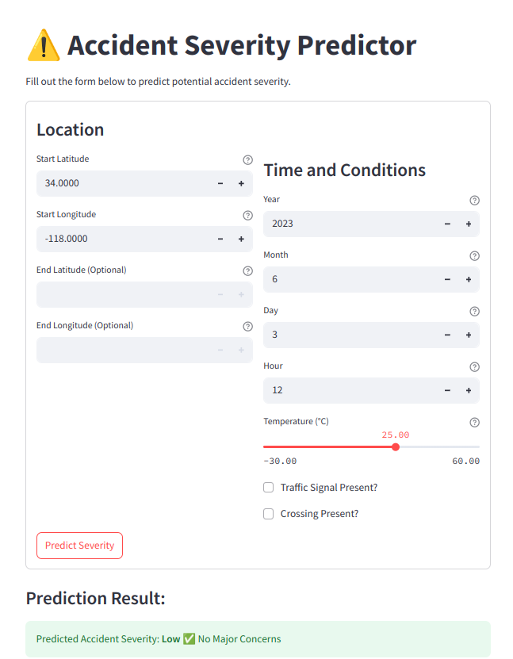
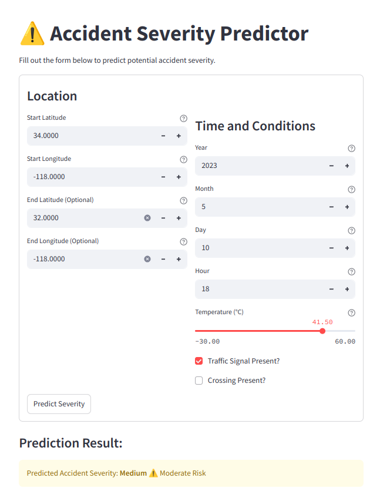
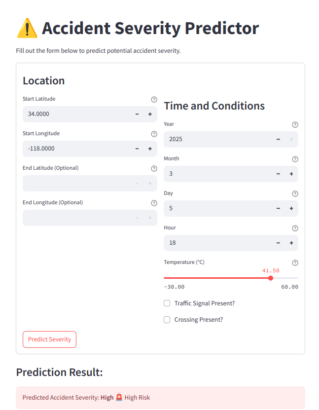

# Accident Severity Prediction using Random Forest Classifier

[](https://opensource.org/licenses/MIT)


## Overview

This project focuses on developing a predictive model to identify the severity of road traffic accidents. By leveraging historical accident data and various contributing factors, the goal is to build an accurate and reliable accident severity prediction system. The project utilizes the Random Forest Classifier algorithm and provides an interactive Streamlit web application to demonstrate its capabilities.

## Dataset

The project utilizes the "Accident-Data.csv" dataset, which contains information about road traffic accidents, including various features related to accident circumstances and severity. The dataset was obtained from Kaggle. Due to its size (approximately 188 MB), the dataset is managed using Git Large File Storage (Git LFS).

## Key Features

* **Data Preprocessing:** Handling missing values, unit conversion, datetime conversion and undersampling for balanced and clean training data
* **Robust Model with Hyperparameter Tuning:** Implementation of the Random Forest Classifier, optimized using RandomizedSearchCV to find a good combination of hyperparameters for improved performance.
* **Performance Evaluation:** Thorough evaluation of the model's predictive accuracy using metrics such as accuracy, precision, recall, and F1-score.
* **Interactive Web Application:** A Streamlit application allows users to input accident parameters and receive severity predictions.
* **Model Persistence:** The trained Random Forest model is saved for easy loading and use.

## Technologies Used

* **Python:** Programming language used for the entire project.
* **Pandas:** For data manipulation and analysis.
* **Matplotlib and Seaborn:** For creating insightful data visualizations
* **Scikit-learn (sklearn):** For data splitting, preprocessing, model implementation (Random Forest Classifier), and evaluation metrics.
* **Streamlit:** For creating the interactive web application.

## Setup and Installation

1.  **Clone the repository:**

    ```bash
    git clone [https://github.com/Abhinav-Marlingaplar/Accident-Severity-Predictor.git](https://github.com/Abhinav-Marlingaplar/Accident-Severity-Predictor.git)
    cd Accident-Severity-Predictor
    ```

2.  **Install required libraries manually:**

    This project relies on the following Python libraries. Please ensure you have them installed in your environment. You can install them using pip:

    ```bash
    pip install requirements.txt
    ```

## Usage

1.  **Ensure the data is available:** The  `Accident-Data.csv`  file should be present in the main directory.  If you have cloned the repository with Git LFS properly configured, this file will be downloaded automatically.

2.  **Run the Streamlit application:**

    ```bash
    streamlit run app.py
    ```

    The Streamlit application will open in your default web browser.  You can then interact with the application to get accident severity predictions.

### Sample Images of Streamlit Application
<div style="display: flex; justify-content: center;">
    
    
    
</div>

## Results

The Random Forest Classifier model demonstrated strong predictive capabilities on the unseen validation set.

**Validation Set Performance:**

| Severity Class | Precision | Recall | F1-Score | Support |
| :------------- | :-------- | :----- | :------- | :------ |
| 1             | 0.91      | 0.92   | 0.91       | 855       |
| 2             | 0.67      | 0.55   | 0.61       | 855       |
| 3             | 0.71      | 0.71   | 0.71       | 855       |
| 4             | 0.69      | 0.81   | 0.74       | 855       |

**Overall Accuracy:** 0.747

The model exhibits high accuracy, particularly for the most frequent severity class (Class 1).

## License

This project is licensed under the MIT License. See the  `LICENSE`  file for more details.

## Author

Abhinav Marlingaplar
